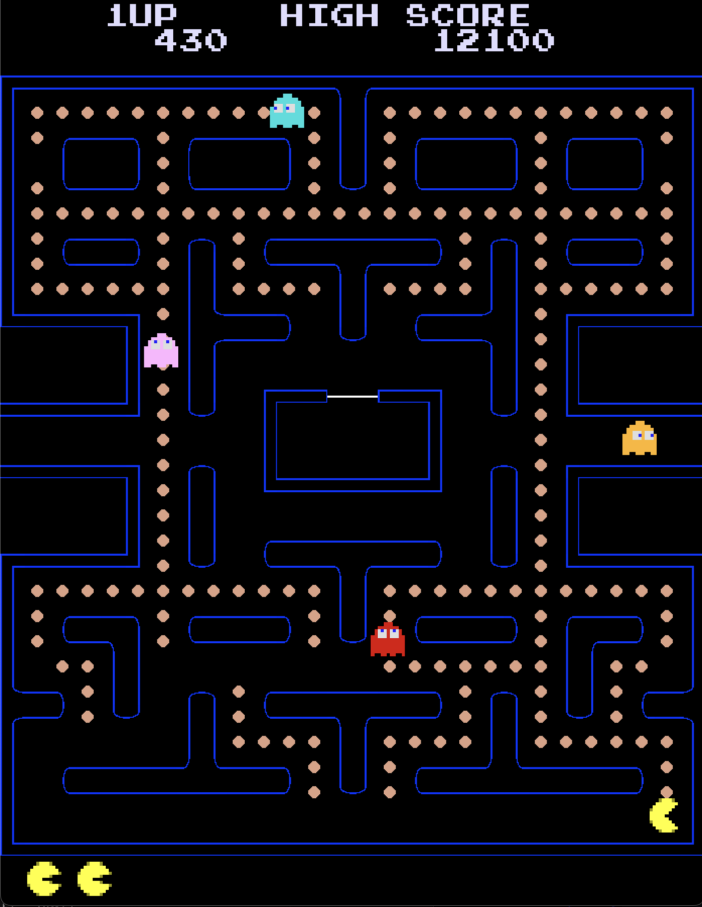

# Pacman Pygame Project

## Introduction

This project is a recreation of the classic Pacman game using Python and the Pygame library. The goal of this project is to provide a fun and engaging experience while also serving as a learning tool for those interested in game development with Python.

## Installation & Deployment

1. Option One:
    1. Download the whole project.
    2. Download Python3 [https://www.python.org/downloads/]
    3. Install Pygame [You can download using pip3 or homebrew]
    4. In terminal, navigate to the file Game.py
    5. In terminal, type python3 Game.py and press enter to play the game.
2. Option Two:
    1. Download the whole project.
    2. Download Python3, Visual Studio Code and install Pygame.
    3. Launch Visual Studio Code and open the whole project folder you downloaded.
    4. Find the file Game.py in the project folder.
    5. Open and run the file Game.py to play the game.

## Gameplay

This is a basic Pacman game. Your goal is to eat all the pellets (Tic - Taks) appeared on the game board without getting caught by the ghosts. There are 4 special pellets (Special Tic-Taks) which grant you a power-up that allows you to have the ability to eat the ghosts and get even more scores in a short amount of time.

The game has a total of 8 levels, you finish a level by eating all the pellets (Tic - Taks) on the game board without using all of your lives (You start the game with 3 lives, but you can get 1 additional life by reaching 10000 score). Everytime you finish a level, you get to the next level, which is the same game board filled again with pellets (Tic - Taks). So as you continue and clear the game board 8 times, you have officially won the game.

The game controls are very simple. You move your Pacman with W, S, A, D keys or arrow keys. You play the game with Space key and quit the game with Enter key.

The game also has a highest score mechanic that saves your highest score and display it in the game. So, good luck and have fun trying out the game ;))

